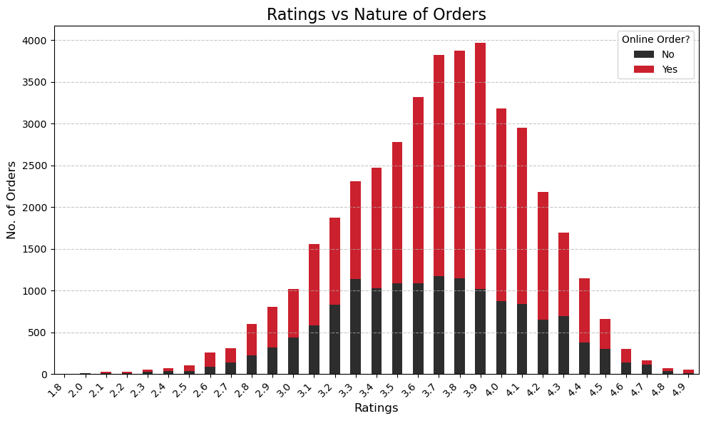
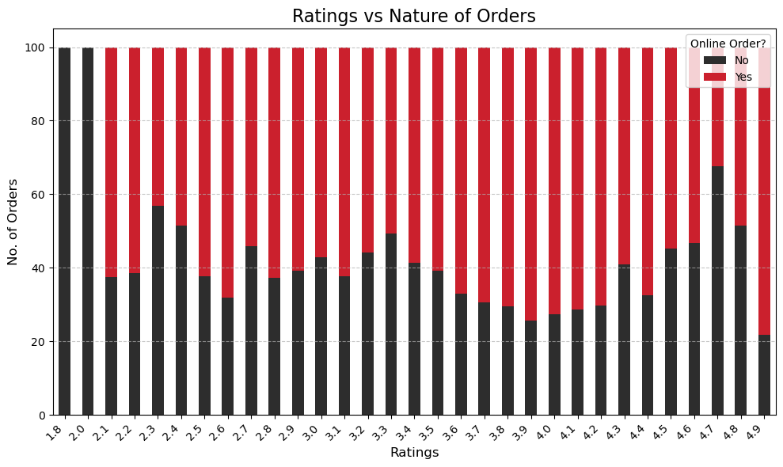
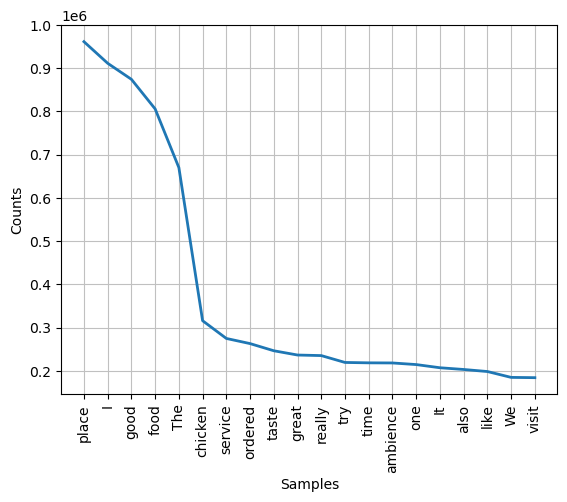
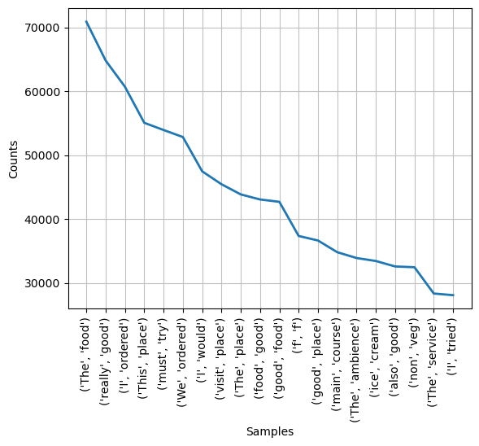
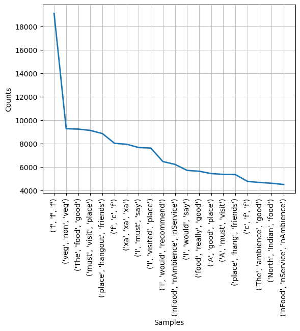

# Zomato-data-EDA-project

# Exploring Culinary Preferences in Bangalore: An EDA on the Zomato Dataset

## Project Overview
This project aims to uncover insights into the dining trends in Bangalore using the Zomato dataset. By analyzing various factors such as restaurant ratings, online orders, food preferences, and geospatial trends, we provide a comprehensive view of the city’s culinary landscape. The analysis focuses on customer preferences, restaurant performance, and location-based insights to guide decision-making for restaurant owners and food entrepreneurs.

## Key Aspects
- **Restaurant Ratings & Online Orders**: Analyzing the relationship between ratings and online order acceptance revealed that higher-rated restaurants tend to receive more orders, suggesting a strong link between customer satisfaction and restaurant popularity.
  
- **Food Preferences**: Using unigram and bigram analysis on customer reviews, the most popular food items were identified, providing valuable insights into local tastes and preferences.

- **Geospatial Analysis**: The density of restaurants was mapped, showing that central Bangalore is the most popular area for restaurants. Heatmaps were used to visualize this data and highlight areas with fewer restaurants, revealing opportunities for new ventures.

## Tools and Libraries
- **Python**: The primary programming language used for analysis.
- **Pandas**: For data manipulation and cleaning.
- **Matplotlib & Seaborn**: For creating visualizations, including heatmaps.
- **Numpy**: For numerical operations.
- **NLP Techniques**: Unigram and bigram analysis for extracting food preferences from customer reviews.
- **Geopandas**: For geospatial analysis of restaurant locations.

## Key Findings
- **Restaurant Concentration**: Most restaurants are located in central Bangalore, with fewer establishments as you move away from the city center.
- **Customer Food Preferences**: North Indian and South Indian cuisines are the most preferred, with chicken dishes being particularly popular.
- **Heatmaps for Opportunity**: Heatmaps show restaurant density and can be used to identify areas with growth potential for new restaurants.

## Visualizations
- **Heatmaps**: Screenshots of the heatmaps showing restaurant density are included in the images folder (`/images`). These heatmaps highlight prime locations and potential opportunities for food businesses.

## Conclusion
This analysis provides a deeper understanding of Bangalore's dining trends, offering practical insights for restaurant owners and entrepreneurs. The results can be leveraged to tailor restaurant menus, improve service offerings, and identify strategic locations for new ventures.

## File Structure

To download the dataset , use this link - https://drive.google.com/file/d/1v3j8IL55aiZlYGI3n6FBivTookyEFKbk/view?usp=sharing
